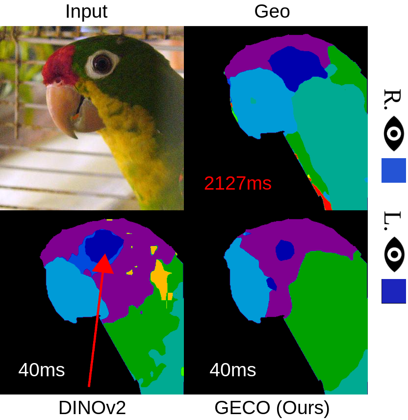
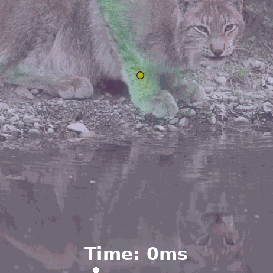
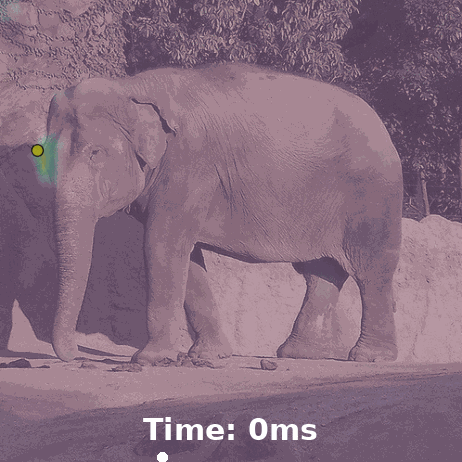

# 🦎 GECO: Geometrically Consistent Embedding with Lightspeed Inference (ICCV 2025)


[ 🌐**Project Page**](https://reginehartwig.github.io/publications/geco/) • [📄  **Paper**](https://arxiv.org/pdf/2508.00746) 

<div style="display: flex; align-items: center; gap: 10px;">
    
    

</div>

This is the official repository for the ICCV 2025 paper:

 > **GECO: Geometrically Consistent Embedding with Lightspeed Inference**.
>
>[Regine Hartwig](https://reginehartwig.github.io/)<sup>1,2</sup>, 
>[Dominik Muhle](https://dominikmuhle.github.io/)<sup>1,2</sup>,
>[Riccardo Marin](https://ricma.netlify.app/)<sup>1,2</sup>,
>[Daniel Cremers](https://cvg.cit.tum.de/members/cremers)<sup>1,2</sup>,
> 
> <sup>1</sup>Technical University of Munich, <sup>2</sup>MCML
>
> [**ICCV 2025** (arXiv)](https://arxiv.org/pdf/2508.00746)


If you find our work useful, please consider citing our paper:
```
@inproceedings{hartwig2025geco,
  title={GECO: Geometrically Consistent Embedding with Lightspeed Inference},
  author={Hartwig, Regine and Muhle, Dominik and Marin, Riccardo and Cremers, Daniel},
  booktitle = {Proceedings of the IEEE/CVF International Conference on Computer Vision},
  year={2025}
}
```

## Intro

We address the task of geometry-aware feature encoding. A common way to test geometric awareness is through keypoint matching: Given a source image with an annotated keypoint, the goal is to predict the <b style="color: rgb(152, 163, 39);">keypoint</b> in the target image by selecting the location with the highest feature similarity. Below are two examples:
<table>
    <tr>
        <td></td>
        <td></td>
        <td></td>
        <td></td>
    </tr>
</table>

We introduce a training paradigm and a lightweight architecture for learning from image pairs with sparsely annotated keypoints. Additionally, we enhance the testing of features by introducing subdivisions of the commonly used PCK metric and a centroid clustering approach for more densely evaluating the feature space.
## 🔧 Environment Setup
If you're using a Linux machine, set up the Python environment with:
```bash
conda create --name geco python=3.10
conda activate geco
bash setup_env.sh
```
To use [Segment Anything (SAM)](https://github.com/facebookresearch/segment-anything) for mask extraction:

```bash
pip install git+https://github.com/facebookresearch/segment-anything.git
wget https://dl.fbaipublicfiles.com/segment_anything/sam_vit_h_4b8939.pth

```

Install odise in case you want to run the Geo baseline

```bash
git clone git@github.com:NVlabs/ODISE.git
cd ODISE
pip install -e .
```

## 🚀 Get Started

### 📁  Prepare the Datasets

Run the following scripts to prepare each dataset:
* APK:
    ```bash
    bash download_data/prepare_apk.sh
    wget https://github.com/Junyi42/GeoAware-SC/blob/master/prepare_ap10k.ipynb
    ```
    Then run the notebook from GeoAware-SC to preprocess the data.
* CUB:
    ```bash
    bash download_data/prepare_cub.sh
    ```
* PascalParts
    ```bash
    bash download_data/prepare_pascalparts.sh
    ```
* PFPascal
    ```bash
    bash download_data/prepare_pfpascal.sh
    ```
* SPair-71k:
    ```bash
    bash download_data/prepare_spair.sh
    ```

### Extract the mask
1. Define `<your_precomputed_masks_path>` in the dataset config files.
2. Define `<path-model-seg>` in `store_masks.yaml` pointing to the path, where `sam_vit_h_4b8939.pth`is stored.
3. Select the datasets to process in `store_masks.yaml`.
4. Run:
   ```bash
    python scripts/store_masks.py --config-name=store_masks.yaml 
    ```

### Precompute the features (not recommended)
Choose a path and define `<your_precomputed_feats_path>` in the dataset config files.
Define which dataset you want to extract the features for in `store_feats.yaml` and run
```bash
python scripts/store_feats.py --config-name=store_feats.yaml 
```


## 🎯 Pretrained Weights
Pretrained weights are available in ```pretrained_weights/geco```.

## 🧪 Interactive Demos: Give it a Try!

We provide interactive jupyter notebooks for testing.

* [📚 Data Loading Demo](demo_data_loading.ipynb)

    Validate dataset preparation and path setup.

* [🎨 Segmentation Demo](demo_segmenation_nearest_centroid.ipynb)

    Visualize part segmentation using a simple linear classifier.

* [📍 Keypoint Transfer Demo](demo_keypoint_transfer.ipynb)

    Explore keypoint transfer and interactive attention maps.


## 📊 Run Evaluation

Run full evaluation:
```bash
python scripts/run_evaluation_all.py --config-name=eval_all.yaml 
```
Evaluate inference time and memory usage:
```bash
python scripts/run_evaluation_time_mem.py --config-name=eval_time_mem.yaml 
```
Evaluate segmentation metrics:
```bash
python scripts/run_evaluation_seg.py --config-name=eval_seg.yaml 
```


## 🏋️ Train the Model
Before training, comment out the following block in `configs/featurizer/dinov2lora.yaml`:

```yaml
init:
  id: geco
  eval_last: True
```
Then run:
```bash
python scripts/train_pairs.py --config-name=train_pairs.yaml 
```